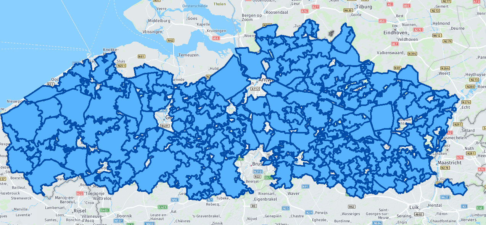
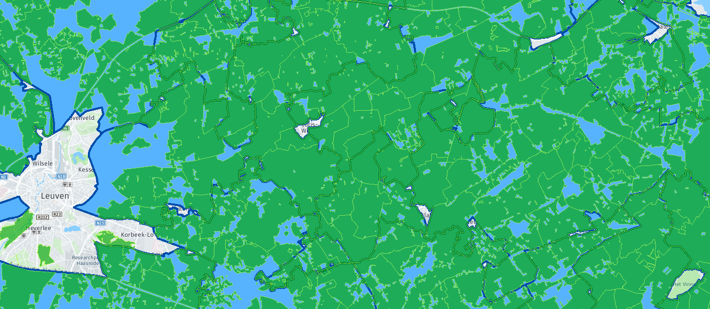
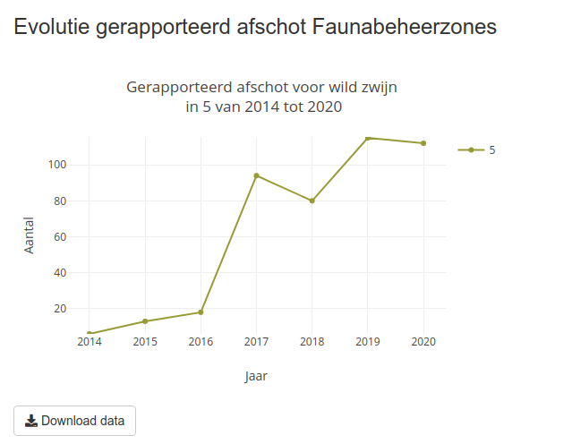
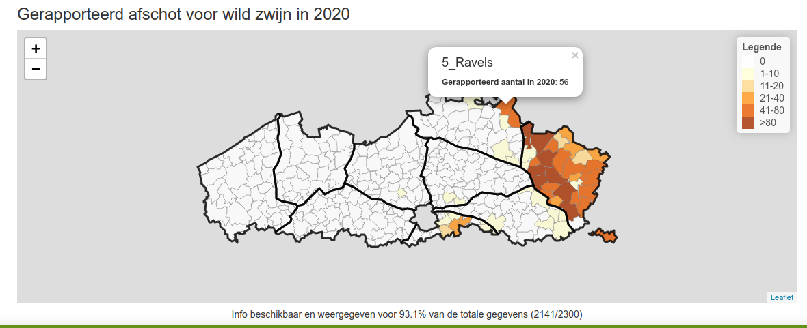

# WBE

## Scenarios

Scenarios: 

* not colored as jachtgebied: not registered as jachtgebied e.g. city center 
* colored as jachtgebied outside a WBE 
* colored as jachtgebied inside a WBE, but not connected to this WBE e.g.
  property of the government that's not rented to a private hunter 
* colored as jachtgebied inside a WBE, and connected to this WBE

In data we will have 2 extra variables: 

* WBE_toek: the WBE it is connected with
* WBE_georef: the WBE it was assigned to, not necessarily connected with it 

We will work with 'WBE_toek', so the no. of animals connected with the selected
WBE. In addition report the percentage of registered animals (I think
WBE_toek/WBE_georef)

## Changes to the App

* We won't be able to show evolution over multiple years for WBE as these regions
  changes over time. More specifically, the line plot below won't be visible. We
  can still show a barplot with the (total) number per selected region for the
  single year. 

* Eenheid: single selection choice "Aantal/100ha"

* Popup window in map: report "WBE_toek" and additionally
  percentage "WBE_toek/WBE_georef"

* Regio-schaal (to be discussed): List with
  - Vlaanderen, Provincie, Gemeente
  - FBZ, WBE (binnen FBZ), Gemeente (binnen FBZ)
  - 5x5 UTM
  
## Open Questions

* Which black borders do they want to show on the WBE maps? The FBZ or
  provinces? Or separate selection for each of them like we currently have for
  communes?
  

